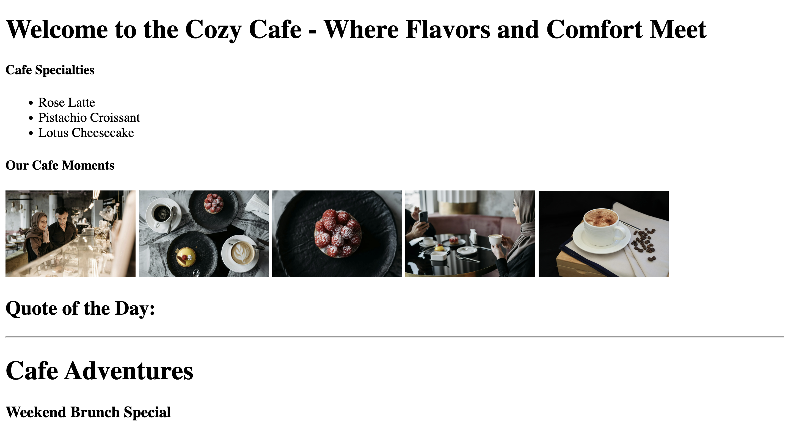

<h1>
  
  Working with the DOM - Cozy Cafe Edition
</h1>

## About

Today, you'll be practicing DOM manipulation and event handling by bringing a cozy cafe website to life. Instead of hard-coding changes into the HTML or CSS, you'll use JavaScript to make dynamic updates to the site.

## Content

- [Setup](./setup/README.md)
- [Exercise](./exercise/README.md)

## Internal

### Prerequisites

- Foundational HTML
- Foundational CSS
- Foundational JavaScript
- DOM Manipulation

### Time to complete

Estimated time to complete core lab exercise: **180 min**

### Resources

- This [DOM Guide](https://gist.github.com/thegitfather/9c9f1a927cd57df14a59c268f118ce86) provides helpful tips on DOM querying and element creation.
- [JavaScript and the DOM](https://developer.mozilla.org/en-US/docs/Web/API/Document_Object_Model/Introduction).

---

**Find a 👾 bug 👾 or have suggestions? [Let us know](https://pages.git.generalassemb.ly/modular-curriculum-all-courses/universal-resources-internal/module-feedback)!**